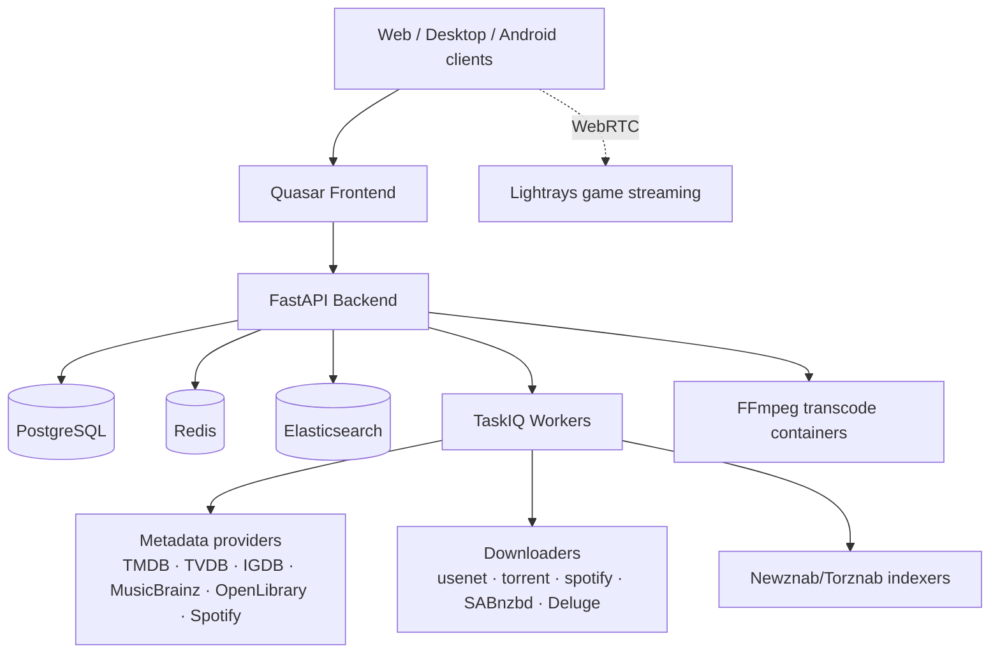

# pyrate.media

**Your media, your rules.** A self-hosted, all-in-one platform for media management, streaming, and automation — media server, download automation, and cloud gaming in a single application.

pyrate.media combines what usually takes half a dozen tools: a streaming media center (à la Jellyfin/Plex), release automation (à la Sonarr/Radarr), and a WebRTC cloud-gaming service — with one library, one user system, and one UI.

📚 **Documentation:** <https://docs.pyrate.luebke.dev>

## Features

### One library for every media type

- **Movies & TV shows** with TMDB/TVDB metadata, cast, trailers, and localized translations
- **Music** — artists, albums, songs (MusicBrainz, Spotify import), persistent audio player with queue, shuffle, lyrics, and Shazam-based song identification
- **Games** — IGDB metadata, Steam library import, playable in the browser via cloud streaming
- **Books** — OpenLibrary metadata and an in-app EPUB reader
- **Photos** — plus a unified parent/child media model shared by all library types

### Streaming & playback

- On-demand FFmpeg transcoding in disposable containers (Docker or Kubernetes Jobs) with VA-API/NVENC hardware acceleration, delivered as HLS
- Direct-play vs. transcode negotiation per client, with configurable playback profiles
- Trickplay scrubbing thumbnails, skip intro/outro/credits markers, chapters
- Subtitles: embedded track selection, provider search & download, upload; lyrics via LRCLIB
- Resume everywhere: viewing history, continue watching, deterministic next-up

### Smart Play & download automation

- Press play on something you don't have yet — it is searched on your indexers, downloaded, and streamed automatically
- Newznab/Torznab indexer support with tier-based search (ID-first, title fallback) and configurable quality/language release scoring
- Download clients: SABnzbd and Deluge, plus three built-in Rust downloader services:
  - **usenet-downloader** — multi-server NNTP with failover, yEnc + CRC32, PAR2 verify/repair, and direct unpack while still downloading
  - **torrent-downloader** — magnet/.torrent downloads via librqbit with DHT and seed-ratio control
  - **spotify-downloader** — native OGG Vorbis downloads via librespot (Spotify Premium required)
- Auto-download for monitored favorites, quality-upgrade scans, RSS sync, live download queue

### Watch together, cast, take it offline

- **Watch parties** — synchronized playback with friends via a simple party code
- **Casting** — Chromecast (Cast V2), AirPlay, and DLNA with network discovery
- **Remote control** — control playback on any of your signed-in devices
- **Offline** — per-device offline downloads with subtitle manifests

### Cloud gaming (Lightrays)

- Rust WebRTC streaming server that runs games in per-session containers (Steam via Games-on-Whales, Wine/DXVK, RetroArch) on a virtual Wayland compositor
- Hardware H.264/H.265 encoding, low-latency input over WebRTC data channels, Docker or Kubernetes session runtimes

### Discovery & curation

- Elasticsearch-backed search with typed autocomplete, saved filters, genre/person/platform browsing
- Trending imports, recommendations, similar media, instant mix
- Playlists, collections, favorites — plus rule-based **smart collections** (cron-scheduled, fed by Trakt/IMDb/Letterboxd/AniList/MyAnimeList/MDBList/TMDB lists), conditional **poster overlays**, and **mass edit operations**
- Fully configurable home page layouts and banners, managed from the admin UI

### Multi-user & administration

- Local JWT auth and OIDC SSO, invite-based registration, email verification, friends
- Groups with granular permissions, parental controls (age ratings, per-library access), API keys
- Optional Stripe-backed memberships with plans and vouchers
- Admin UI for libraries, indexers, downloaders, metadata providers, transcoding, background tasks, backups, activity logs, branding/theming, and more
- Prometheus metrics with a fully provisioned Grafana dashboard

## Clients

| Platform | Delivery |
|----------|----------|
| Web | Quasar SPA (Vue 3) |
| Desktop (Linux/macOS/Windows) | Tauri 2 |
| Android | Capacitor 7 |

UI available in English and German.

## Architecture

| Component | Technology |
|-----------|------------|
| Backend | Python 3.13, FastAPI, SQLModel/SQLAlchemy async, TaskIQ, Alembic |
| Frontend | Vue 3, Quasar 2, Pinia, Video.js, epub.js |
| Data | PostgreSQL 16, Redis 7, Elasticsearch |
| Transcoding | jellyfin-ffmpeg in per-task containers (VA-API/Vulkan/OpenCL) |
| Game streaming | Lightrays — Rust, GStreamer, WebRTC |
| Downloaders | Rust — axum, librqbit, librespot, native NNTP |
| Deployment | Docker Compose, Helm/Kubernetes, Podman quadlets |

## Deployment

Four supported models (see [`deployment/`](deployment/) and the [docs](https://docs.pyrate.luebke.dev)):

- **Local dev** — `docker-compose.yml` in the repo root (locally built images)
- **Single host** — `deployment/docker/docker-compose.yml` with pre-built registry images, or the interactive installer: `curl -fsSL https://get.pyrate.media | sudo bash`
- **Kubernetes** — Helm chart at `deployment/helm/pyrate` (also published as an OCI artifact), with K8s-native transcode Jobs
- **Podman quadlets** — lean systemd-managed single-host variant

## Repository layout

| Path | Contents |
|------|----------|
| `backend/` | FastAPI API + TaskIQ workers (Python) |
| `frontend/` | Quasar/Vue app — web, Tauri desktop, Capacitor Android |
| `lightrays/` | WebRTC game-streaming server (Rust) |
| `downloaders/` | torrent / spotify / usenet downloader services (Rust) |
| `deployment/` | Docker Compose, Helm chart, quadlets, installer, backup tooling |
| `containers/` | Wine and RetroArch game-streaming images |
| `observability/` | Prometheus + Grafana provisioning |
| `docs/` | MkDocs Material documentation site |

Each component has its own README with development instructions. Secrets are never committed — create `.env` files from the `.env.example` templates in each subproject.

## License

Proprietary. All rights reserved.
