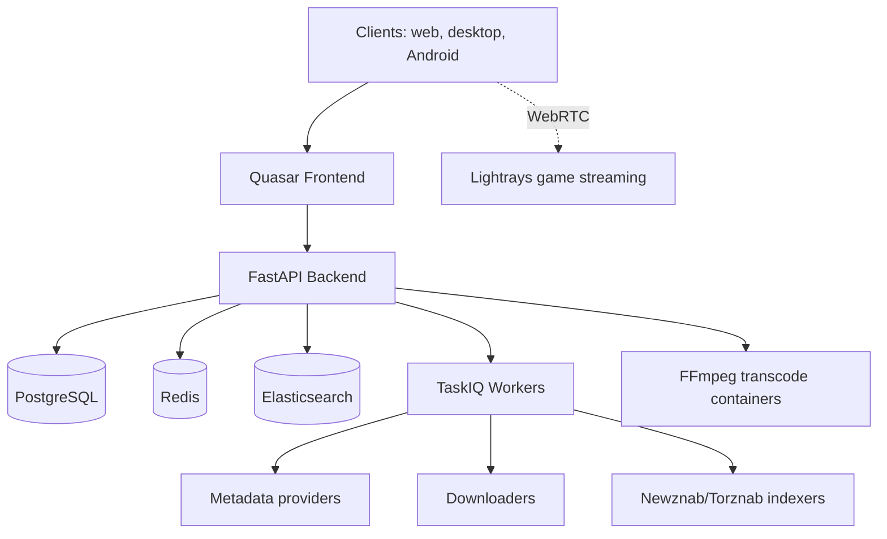

# Streamarr

**Your media, your rules.** A self-hosted, all-in-one platform for media management, streaming, and automation: media server, download automation, and cloud gaming in one application.

Streamarr replaces what usually takes half a dozen tools. A streaming media center (à la Jellyfin/Plex), release automation (à la Sonarr/Radarr), and a WebRTC cloud-gaming service share one library, one user system, and one UI.

📚 **Documentation:** <https://streamarr.luebke.dev>

## Features

**One library for every media type.** Movies & TV (TMDB/TVDB), Music (MusicBrainz, Spotify import, Shazam song identification), Games (IGDB, Steam import), Books (OpenLibrary, in-app EPUB reader), and Photos, all on a unified parent/child media model.

**Streaming & playback.** On-demand FFmpeg transcoding in disposable containers (Docker or Kubernetes Jobs) with Intel QuickSync acceleration, delivered as HLS. Direct-play vs. transcode negotiation, playback profiles, trickplay thumbnails, skip intro/outro markers, chapters, subtitles (embedded, provider search, upload), lyrics via LRCLIB, and resume everywhere.

**Smart Play & downloads.** Press play on something you don't have yet: it is searched on your indexers, downloaded, and streamed automatically. Newznab/Torznab indexers, quality and language release scoring, SABnzbd and Deluge, plus three built-in Rust services:

- **usenet-downloader**: multi-server NNTP, yEnc + CRC32, PAR2 verify/repair, unpack while downloading
- **torrent-downloader**: magnet/.torrent via librqbit with DHT and seed-ratio control
- **spotify-downloader**: native OGG Vorbis via librespot (Spotify Premium required)

**Watch together, cast, take it offline.** Watch parties with a party code, Chromecast (Cast V2), AirPlay, and DLNA, remote control across signed-in devices, and per-device offline downloads.

**Cloud gaming (Lightrays).** A Rust WebRTC server runs games in per-session containers (Steam via Games-on-Whales, Wine/DXVK, RetroArch) on a virtual Wayland compositor, with hardware H.264/H.265 encoding and low-latency input over WebRTC data channels.

**Discovery & curation.** Elasticsearch-backed search with typed autocomplete, trending imports, recommendations, playlists, collections, favorites, rule-based smart collections (Trakt/IMDb/Letterboxd/AniList/MyAnimeList/MDBList/TMDB), conditional poster overlays, mass edit operations, and configurable page layouts.

**Multi-user & administration.** Local JWT auth and OIDC SSO, invites, friends, groups with granular permissions, parental controls, API keys, optional Stripe memberships, an admin UI for every subsystem, and Prometheus metrics with a Grafana dashboard.

## Clients

Web (Quasar SPA, Vue 3), Desktop for Linux/macOS/Windows (Tauri 2), and Android (Capacitor 7). UI available in English and German.

## Architecture

```mermaid
graph TB
    A[Clients: web, desktop, Android] --> B[Quasar Frontend]
    B --> C[FastAPI Backend]
    C --> D[(PostgreSQL)]
    C --> E[(Redis)]
    C --> G[(Elasticsearch)]
    C --> F[TaskIQ Workers]
    F --> H[Metadata providers]
    F --> I[Downloaders]
    F --> J[Newznab/Torznab indexers]
    C --> K[FFmpeg transcode containers]
    A -.->|WebRTC| L[Lightrays game streaming]
```

| Component | Technology |
|-----------|------------|
| Backend | Python 3.13, FastAPI, SQLModel/SQLAlchemy async, TaskIQ, Alembic |
| Frontend | Vue 3, Quasar 2, Pinia, Video.js, epub.js |
| Data | PostgreSQL 16, Redis 7, Elasticsearch |
| Transcoding | jellyfin-ffmpeg in per-task containers (Intel QSV) |
| Game streaming | Rust, GStreamer, WebRTC |
| Downloaders | Rust, axum, librqbit, librespot, native NNTP |
| Deployment | Docker Compose, Helm/Kubernetes, Podman quadlets |

## Deployment

Four supported models, see [`deployment/`](deployment/) and the [docs](https://streamarr.luebke.dev):

- **Local dev**: `docker-compose.yml` in the repo root, with locally built images
- **Single host**: `deployment/docker/docker-compose.yml` with pre-built images, or the installer: `curl -fsSL https://get.streamarr.media | sudo bash`
- **Kubernetes**: Helm chart at `deployment/helm/streamarr`, also published as an OCI artifact, with K8s-native transcode Jobs
- **Podman quadlets**: lean systemd-managed single-host variant

## Repository layout

| Path | Contents |
|------|----------|
| `backend/` | FastAPI API + TaskIQ workers (Python) |
| `frontend/` | Quasar/Vue app: web, Tauri desktop, Capacitor Android |
| `lightrays/` | WebRTC game-streaming server (Rust) |
| `downloaders/` | torrent / spotify / usenet downloader services (Rust) |
| `deployment/` | Docker Compose, Helm chart, quadlets, installer, backup tooling |
| `containers/` | Wine and RetroArch game-streaming images |
| `observability/` | Prometheus + Grafana provisioning |
| `docs/` | MkDocs Material documentation site |

Secrets are never committed. Create `.env` files from the `.env.example` templates in each subproject.

## License

Proprietary. All rights reserved.
