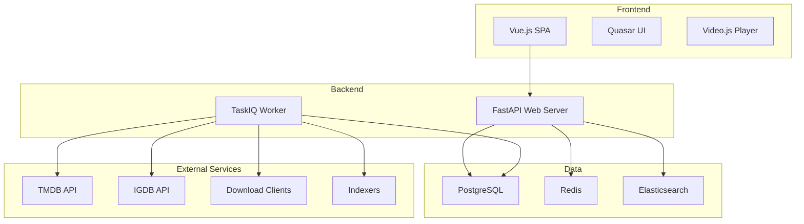

# Overview

This section helps you understand what Pyrate.Media is, how it works, and how to get started.

## What is Pyrate.Media?

Pyrate.Media is an all-in-one media management platform that enables the following:

- **Discover**: Find new movies, shows, and games
- **Organize**: Manage media in libraries and lists
- **Stream**: Play directly in the browser
- **Automate**: Automatically search for and start downloads
- **Share**: Host watch parties with friends

## Core Concepts

### Media Types

Pyrate.Media supports various media types:

#### 🎬 Movies
- Movie database with TMDB metadata
- Posters, backdrops, and descriptions
- Release tracking and download management
- Direct playback in the browser

#### 📺 Shows
- Full show management
- Seasons and episodes with metadata
- Automatic release search per episode
- Episode-based streaming

#### 🎮 Games
- Game library with IGDB integration
- Platform and genre information
- Cover art and screenshots

### Libraries

Each media type has its own library:

- **Create library**: Admin creates libraries for desired media types
- **Plugin-based**: Each library uses a library plugin (movies, shows, games)
- **Configurable**: Storage paths, naming schemes, and download rules

### Smart Play

The Smart Play system makes playback simple:

1. **File available** → Streaming starts immediately
2. **Releases available** → Download is started, status displayed
3. **No releases** → Search is started, then download

The client polls the status until the media is ready to play.

### Lists

Organize media with lists:

- **User lists**: Create your own collections
- **System lists**: Automatic trending lists
- **Visibility**: Private, public, or shared
- **Interactions**: Like, follow, bookmark

## System Requirements

### Minimum

- **CPU**: 2 cores, 2.0 GHz
- **RAM**: 4 GB
- **Storage**: 20 GB free
- **Network**: Stable internet connection

### Recommended

- **CPU**: 4+ cores (for transcoding)
- **RAM**: 8 GB or more
- **Storage**: 50 GB+ (SSD recommended)
- **Network**: Fast connection for streaming

### Dependencies

- **Docker**: For container deployment
- **PostgreSQL**: Main database
- **Redis**: Caching and task queue
- **Elasticsearch**: Media search (optional)

## Architecture

### Components

#### Frontend (Vue.js)
- **Vue 3**: Composition API with `<script setup>`
- **Quasar**: Material Design components
- **Pinia**: State management
- **Video.js**: Media playback
- **Vue I18n**: Internationalization

#### Backend (FastAPI)
- **FastAPI**: Async Python web framework
- **SQLModel**: ORM based on SQLAlchemy
- **TaskIQ**: Background task queue
- **JWT**: Authentication

#### Plugins
- **Metadata**: TMDB, IGDB for metadata
- **Downloader**: SABnzbd, Deluge
- **Indexer**: Newznab-based indexers
- **Library**: movies, shows, games plugins

## Next Steps

1. **[Installation](installation.md)** - Set up Pyrate.Media
2. **[Quick Start](quick-start.md)** - First steps
3. **[Dashboard](../user-guide/dashboard.md)** - Get to know the interface
