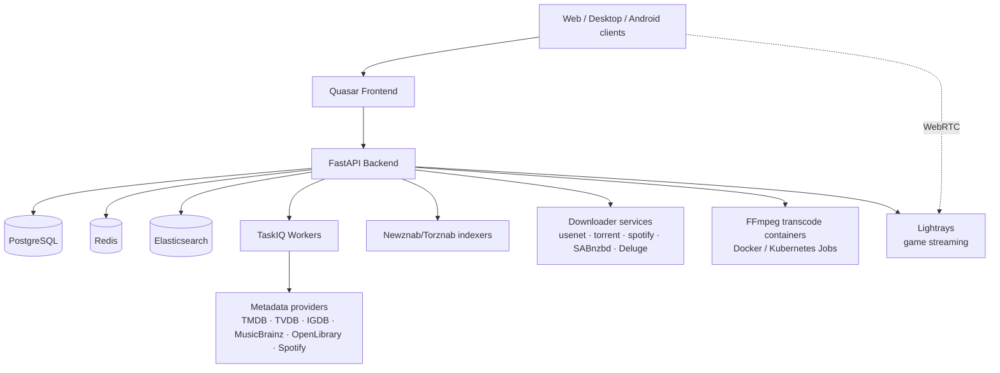

# Welcome to Pyrate.Media

**Your all-in-one platform for media management, streaming, and automation.**

## What is Pyrate.Media?

Pyrate.Media combines what usually takes half a dozen tools: a streaming media center (like Jellyfin or Plex), download automation (like Sonarr/Radarr), and a WebRTC cloud-gaming service — in a single application, with one library, one user system, and one UI. Your media, your rules.

## One library, six media types

| Media type | Highlights |
|------------|------------|
| [Movies](user-guide/movies.md) & [Shows](user-guide/shows.md) | TMDB/TVDB metadata, cast, trailers, localized translations |
| [Music](user-guide/music.md) | Artists, albums, songs; persistent player with queue, shuffle, lyrics, and song identification |
| [Games](user-guide/games.md) | IGDB metadata, Steam library import, playable in the browser via cloud streaming |
| [Books](user-guide/books.md) | OpenLibrary metadata and an in-app EPUB reader |
| Photos | Photo libraries share the same unified media model |

Explore people (actors, directors) across their filmography, and find everything with [search](user-guide/search.md) — typed autocomplete, saved filters, genre and platform browsing.

## Stream, cast, take it offline

- **Smart Play** — press play on something you don't have yet: it is searched on your indexers, downloaded, and streamed automatically
- **Real-time transcoding** — on-demand FFmpeg in disposable containers, delivered as HLS, with direct play when your device supports the codecs ([Streaming & Playback](user-guide/streaming.md))
- **Resume everywhere** — viewing history, continue watching, skip intro/outro markers, trickplay scrubbing
- **Audio & subtitles** — track selection, provider search, and per-user language preferences
- **Casting & offline** — Chromecast, AirPlay, and DLNA; remote-control your other signed-in devices; per-device offline downloads ([Devices, Casting & Offline](user-guide/devices.md))

!!! tip "Watch together"
    Start a [watch party](user-guide/watch-parties.md) and share the 6-digit code — play, pause, and seek stay in sync for everyone. Invite [friends](user-guide/friends.md) to your server first.

## Automate your library

- Newznab/Torznab [indexers](administration/indexers.md) with configurable quality and language scoring
- [Download clients](administration/downloaders.md): SABnzbd and Deluge, plus three built-in Rust downloader services for usenet, torrents, and Spotify
- Auto-download for monitored favorites, quality-upgrade scans, RSS sync, live download queue
- Rule-based [smart collections and poster overlays](administration/smart-collections.md), fed by Trakt, IMDb, Letterboxd, AniList, MyAnimeList, MDBList, and TMDB lists

## Multi-user by design

Local login and OIDC SSO, invite-based registration, groups with granular permissions, and parental controls. Optionally sell access with Stripe-backed [memberships and vouchers](administration/membership.md) — users manage their plan on the [membership page](user-guide/membership.md).

## Clients & languages

| Platform | Delivery |
|----------|----------|
| Web | Quasar SPA (Vue 3) |
| Desktop (Linux/macOS/Windows) | Tauri 2 |
| Android | Capacitor 7 |

The interface is fully available in **English** and **German**.

## Architecture

## Technology stack

| Component | Technology |
|-----------|------------|
| **Backend** | Python 3.13, FastAPI, SQLModel/SQLAlchemy async, TaskIQ, Alembic |
| **Frontend** | Vue 3, Quasar 2, Pinia, Video.js, epub.js |
| **Data** | PostgreSQL, Redis, Elasticsearch |
| **Transcoding** | jellyfin-ffmpeg in per-task containers (VA-API/Vulkan/OpenCL) |
| **Game streaming** | Lightrays — Rust, GStreamer, WebRTC |
| **Downloaders** | Rust — axum, librqbit, librespot, native NNTP |
| **Deployment** | Docker Compose, Helm/Kubernetes, Podman quadlets |

## Getting started

=== "As a user"

    1. Log in — or register with an invite link ([Account & Login](user-guide/account.md))
    2. Explore the [home page](user-guide/dashboard.md) and the libraries
    3. [Play media](user-guide/streaming.md), build [lists](user-guide/lists.md), mark [favorites](user-guide/favorites.md)
    4. Set up your [devices](user-guide/devices.md) for casting and offline, and start a [watch party](user-guide/watch-parties.md)

=== "As an administrator"

    1. [Install](getting-started/installation.md) Pyrate.Media — one-line installer, Docker Compose, Helm, or Podman quadlets
    2. Follow the [quick start](getting-started/quick-start.md) through the setup wizard
    3. Create [libraries](administration/libraries.md) and configure [indexers](administration/indexers.md) and [download clients](administration/downloaders.md)
    4. Curate with [smart collections](administration/smart-collections.md), then set up [backups](administration/maintenance.md) and [monitoring](administration/monitoring.md)

## Next steps

- [Getting Started](getting-started/overview.md) — what you need and how the pieces fit
- [User Guide](user-guide/dashboard.md) — get to know the app
- [Administration](administration/overview.md) — configure the system
- [Deployment](deployment/overview.md) — Compose, Kubernetes, and quadlets in depth
- [Development](developer-guide/overview.md) — hack on Pyrate.Media itself
