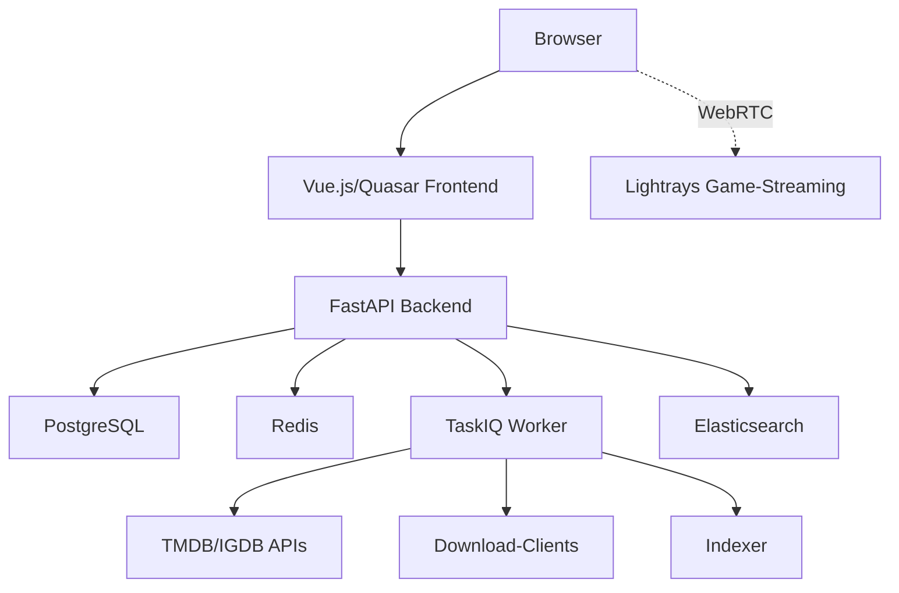

# Welcome to Pyrate.Media

**Your all-in-one platform for media management, streaming, and automation.**

## What is Pyrate.Media?

Pyrate.Media combines the functionality of a media center (like Jellyfin or Plex) with automation features (like Sonarr/Radarr) in a single application. The platform allows you to discover, organize, stream, and automatically download movies, shows, and games.

## What can you do with it?

### Discover & manage media

- **Movies & Shows** — browse with full metadata from TMDB and add them to your library
- **Games** — catalog with IGDB integration
- **People** (actors, directors) — explore their filmography
- Everything in a modern, dark interface with poster views and hero carousels

### Stream directly in the browser

- **Smart Play**: Click play — the system takes care of the rest. If the file is available, the stream starts. If it's missing, it is automatically searched and downloaded.
- **Real-time transcoding**: Videos are converted on-the-fly for your browser (HLS via FFmpeg)
- **Seeking & resuming**: Jump to any position in the video. Your progress is saved so you can pick up right where you left off later.
- **Automatic language selection**: Audio and subtitles based on your preferences

### Watch together

- **Watch Parties**: Invite friends and watch the same movie in sync — with a simple 6-digit code
- **Real-time synchronization**: Play, pause, and seek are executed simultaneously for all participants

### Stream games

- **Game streaming via Lightrays**: Play games directly in the browser — streamed via WebRTC from a Rust-based streaming server with GPU acceleration

### Organize & share

- **Lists** — create watchlists, favorites, themed collections
- **Favorites** — mark with a single click
- **Playback history** with progress indicator
- **Invite friends** and share the instance

### Automate

- **Download management**: SABnzbd (Usenet) and Deluge (Torrents) integration
- **Indexers**: Automatic release search via Newznab/Torznab indexers
- **Quality rules**: Configurable scoring rules for the best download selection
- **Trending import**: Automatically import popular media from TMDB/IGDB

## Architecture

## Technology Stack

| Component | Technology |
|-----------|------------|
| **Frontend** | Vue 3, Quasar Framework, Pinia, Video.js, Vue I18n |
| **Backend** | Python, FastAPI, SQLModel, TaskIQ, JWT + OIDC |
| **Database** | PostgreSQL, Redis, Elasticsearch |
| **Streaming** | FFmpeg (Docker), HLS |
| **Game Streaming** | Lightrays (Rust, GStreamer, WebRTC) |
| **Infrastructure** | Docker, Kubernetes, Helm |

## Languages

The interface is fully available in **German** and **English**. Audio and subtitle preferences can be configured independently.

## Getting Started

=== "As a User"

    1. Log in (via login or OIDC)
    2. Explore the [home page](user-guide/dashboard.md) and the libraries
    3. [Play media](user-guide/streaming.md) or create [lists](user-guide/lists.md)
    4. Invite [friends](user-guide/friends.md) and start a [watch party](user-guide/watch-parties.md)

=== "As an Administrator"

    1. [Install](getting-started/installation.md) Pyrate.Media
    2. Follow the [quick start](getting-started/quick-start.md)
    3. Configure [plugins, indexers, and download clients](administration/overview.md)
    4. Create libraries and import trending content

## Next Steps

- [Installation](getting-started/installation.md) — Set up Pyrate.Media
- [Quick Start](getting-started/quick-start.md) — First steps
- [User Guide](user-guide/dashboard.md) — Get to know the app
- [Administration](administration/overview.md) — Configure the system
